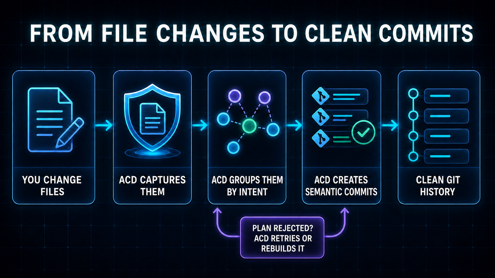

# ACD

ACD turns the changes you make in files into clean local Git history. You work
normally. ACD captures the changes first, groups related work by intent, and
creates semantic commits in the background.

The normal flow is simple:

1. You change files.
2. ACD captures those changes in a durable private checkpoint.
3. ACD groups related changes by intent.
4. ACD creates semantic local commits.
5. You get a clean, reviewable Git history.

If an AI-generated plan is invalid or unsafe, ACD rejects it. It retries or
rebuilds the plan while the captured checkpoint stays protected. A provider
outage, failed check, or Git operation can delay commits, but it does not undo
a completed checkpoint.

ACD never pushes. You decide when and where to publish your commits.

## Requirements

- macOS or Linux on `arm64` or `amd64`
- Git installed and available on `PATH`
- A normal Git worktree on an attached branch
- A configured Git author name and email
- A working systemd user manager on Linux

Check your Git identity:

~~~bash
git config --global user.name
git config --global user.email
~~~

Set either value if it is missing:

~~~bash
git config --global user.name "Your Name"
git config --global user.email "you@example.com"
~~~

The released binary does not require Go. The default setup does not require an
API key, a Git remote, a GitHub account, or Full Disk Access on macOS.

## Install

### Homebrew

~~~bash
brew install KristjanPikhof/tap/acd
acd --version
~~~

### Verified release installer

~~~bash
curl -fsSL \
  https://raw.githubusercontent.com/KristjanPikhof/Auto-Commit-Daemon/main/scripts/install.sh |
  bash
~~~

The installer selects the correct macOS or Linux release, verifies its
SHA-256 checksum, and installs `acd` in `$HOME/.local/bin` by default. If your
shell cannot find it, add that directory to `PATH`:

~~~bash
export PATH="$HOME/.local/bin:$PATH"
acd --version
~~~

The installer needs Bash, `curl`, `tar`, `install`, and either `shasum` or
`sha256sum`. `jq` is optional.

## Set up once, then enable each repository

### 1. Set up ACD for your user account

~~~bash
acd setup
~~~

Setup asks how you want ACD to group changes, format commit messages, and
choose a provider. Choose Everyday for Intent commits. The local provider
works offline; choose an OpenAI-compatible provider for AI-generated grouping
and semantic commit messages.

ACD shows one exact plan before changing anything. Once you approve it, setup
installs the managed runtime, starts the background supervisor, and adds any
integrations you selected.

Setup is user-wide. It does not enable the current repository.

To inspect the plan without making changes:

~~~bash
acd setup --dry-run
~~~

### 2. Enable one repository

~~~bash
cd /path/to/repository
acd on
~~~

`acd on` registers only that repository, starts its worker, and waits until
the current eligible files have a verified checkpoint. You can run it again
safely.

Run `acd on` once in every repository that you want ACD to protect.

### 3. Confirm protection

~~~bash
acd status
~~~

Look for:

~~~text
ACD protection: on
Current changes protected: yes
Action needed: no
~~~

`Commit mode` should be `Intent` when you selected Everyday. The publication
queue may still contain protected changes. `Publication phase` explains
whether ACD is grouping, calling the provider, verifying, publishing, waiting,
or recovering.

## Daily use

You do not need to run `git add`, `git commit`, or `acd commit-all` during
normal work. Keep editing files and use these commands when you want to check
what ACD is doing:

| Command | What it tells you |
|---|---|
| `acd` or `acd status` | Full protection and publication state for the current repository |
| `acd list` | Live queue and phase across repositories |
| `acd list --once --verbose` | One detailed dashboard snapshot |
| `acd history` | Retained checkpoints and their local Git publication state |
| `acd history activity` | Recent capture and publication activity |
| `acd doctor` | The problem and the next safe command when action is required |
| `acd off` | Save a final checkpoint and stop protecting this repository |
| `acd on` | Start protection again |

`acd list` is the quickest fleet view:

| Column | Meaning |
|---|---|
| `SAFE` | The latest complete observation has a durable checkpoint |
| `MODE` | Intent or event commit mode |
| `QUEUE` | Protected changes still waiting for local Git publication |
| `TARGET` | Work left in a bounded drain or automatic recovery |
| `LAST MOVE` | Time since durable queue progress, not a heartbeat |
| `PHASE` | Grouping, provider call, verification, waiting, recovery, or publication |
| `STATUS` | Healthy, working, waiting, stalled, paused, or needs action |

`working`, `waiting`, and `stalled` can all be safe states. If protection is
`yes` and `Action needed` is `no`, leave ACD running. It will retry or repair
the publication path itself. Use `acd doctor` only when status says that you
need to act.

## Publish the current work now

Normal Intent mode publishes automatically. When you explicitly want ACD to
finish the currently protected work before you continue, preview a bounded
drain:

~~~bash
acd commit-all --dry-run
acd commit-all --yes
~~~

This does not switch to deterministic commits and does not squash everything
into one commit. It freezes the current target and lets the configured Intent
or event strategy publish it normally. Later edits stay outside that target.

Do not use `commit-all` as a repair command. Check `acd status`, `acd list`, or
`acd doctor` instead. ACD keeps retrying in the background if your terminal
closes.

## How ACD keeps work safe

Protection and Git publication are separate:

1. ACD observes the worktree through file events, an adaptive safety poll, and
   optional coding-tool hints.
2. It writes the complete eligible state to a private Git checkpoint ref.
3. Only completed checkpoints enter Intent planning.
4. ACD validates grouping, dependencies, materialization, verification, and
   the exact Git target before it publishes.
5. Successful groups become ordinary local Git commits.

An invalid or incomplete AI plan is not trusted. ACD can reject it, retry the
provider, or rebuild the plan from the still-protected captures. If the
provider remains unavailable, publication waits without losing the
checkpoint.

Normal publication appends commits. Optional Intent repair can rewrite only a
bounded recent suffix that ACD proves is private, unshared, and ACD-owned. It
does not rewrite pushed or user-owned history.

Read [the architecture overview](docs/overview.md) and [protection and
publication](docs/capture-replay.md) for the full durability protocol.

## Restore a checkpoint

Restore always previews first:

~~~bash
acd history
acd restore cp-...
acd restore cp-... --yes
~~~

ACD checkpoints the current state before applying a restore. It leaves `HEAD`
and the Git index unchanged and returns the pre-restore checkpoint as the undo
target.

See [user workflows](docs/user-workflows.md) for restore, recovery, and support
steps.

## Privacy and providers

Fresh setup uses the local deterministic provider and needs no credential or
network request. You can choose an OpenAI-compatible provider when you want AI
Intent planning and semantic commit messages.

Network diff egress is off until you approve it explicitly. Credentials never
enter status, logs, diagnostics, traces, or plan fingerprints. Full provider
payloads stay out of ordinary diagnostics. The advanced prompt-trace and raw
reject-log options are explicit local opt-ins because their output can contain
sensitive source text. Git-ignored files and configured sensitive paths remain
outside the protected scope.

See [AI providers](docs/ai-providers.md) for the provider and privacy contract.

## Configuration

~~~bash
acd config get
acd config edit
acd config credentials
~~~

Repository settings override profile and global defaults. Use the interactive
editor for advanced Intent, provider, verification, repair, and retention
settings.

See [settings](docs/settings.md) and the generated [configuration
reference](docs/configuration-reference.md).

## Upgrade and uninstall

Upgrade the CLI with the same method you used to install it, then apply the
reviewed runtime plan:

~~~bash
brew upgrade acd        # Homebrew installation
acd setup --dry-run
acd setup
~~~

Uninstall keeps protected repository data by default:

~~~bash
acd uninstall --dry-run
acd uninstall
~~~

## Detailed documentation

- [Command reference](docs/commands.md)
- [User workflows](docs/user-workflows.md)
- [Architecture overview](docs/overview.md)
- [Protection and publication](docs/capture-replay.md)
- [Intent commit flow](docs/intent-commit-flow.md)
- [Settings](docs/settings.md)
- [AI providers](docs/ai-providers.md)
- [Commit-message rewriting](docs/rewrite-commits.md)
- [Changelog](CHANGELOG.md)

## Development

Building from source requires Go 1.26.6:

~~~bash
make build
make lint
make test
~~~

Repository contribution and verification requirements are in
[`CLAUDE.md`](CLAUDE.md). ACD is MIT licensed.
